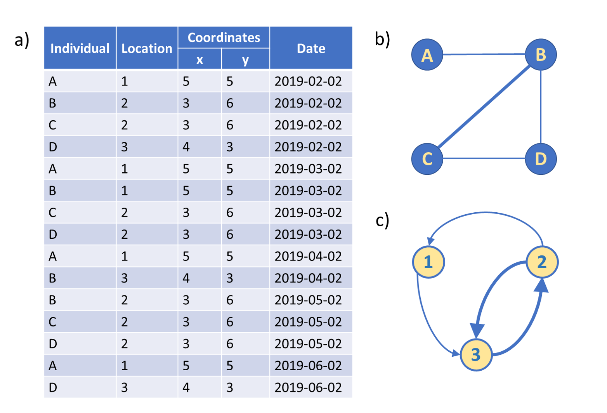
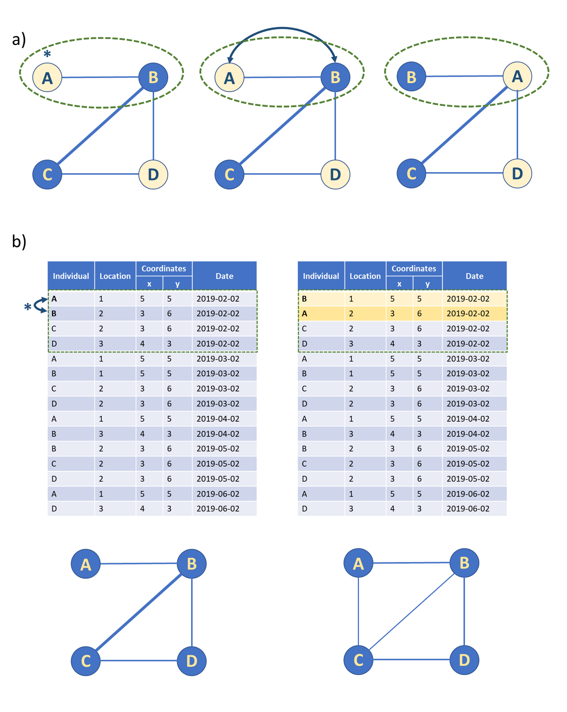

<!-- README.md is generated from README.Rmd. Please edit that file -->

```{r, include = FALSE}
knitr::opts_chunk$set(
  collapse = TRUE,
  comment = "#>",
  fig.path = "man/figures/README-",
  out.width = "100%"
)
```
# __CMRnet__

<!-- badges: start -->
[](https://travis-ci.org/matthewsilk/CMRnet)
<!-- badges: end -->

**CMRnet** is an R package that helps construct social and movement networks from spatio-temporally referenced capture-mark recapture data.

## Bugs and Suggestions

It is very difficult to develop a package that is robust to all types of datasets and user requirements. But we want to help. Please report any bugs or suggestions in the [Issues](https://github.com/matthewsilk/CMRnet/issues).

## Installation

**CMRnet** can be easily downloaded and installed from GitHub using `remotes::install_github()`. The vignettes available with the package can be downloaded by adding `build_vignettes = TRUE`.

```{r install, message=FALSE, eval = FALSE}
# install CMRnet
remotes::install_github("matthewsilk/CMRnet", build_vignettes = TRUE)
```

## General outline of CMRnet

**CMRnet** is an R package that generates social and movement networks from spatially-explicit capture-mark-recapture data, and provides functions for network and datastream permutations for these networks. The conversion of spatially explicit mark-recapture data into social and movement networks will provide insights into the interplay between demography and behaviour in wild animal populations, with important applications in their management and conservation.

#### Example usage of CMRnet



**Figure 1.  A simple example of how CMRnet takes (a) spatially-referenced mark-recapture data to produce (b) social and (c) movement networks.** In the example social network generated here (b) the network window equates to the whole data collection period and the interaction window is 1 (hence only captures occurring on the same day result in an edge in the network). Edges are weighted by the number of co-occurrences. In the example movement network generated here (c) the interaction window is set at 35 days (so only captures in adjacent months are recorded as movements).

#### Types of permutation CMRnet implements



**Figure 2. The two types of permutation procedure provided by CMRnet: (a) node feature swaps (node permutations) and (b) datastream permutations (edge rewiring).** (a) Node feature swaps can be used to account for non-independence while breaking the association between a feature of interest (in this case node colour) and network position. Swaps can be constrained to occur only between particular combinations of individuals (indicated here by the green dashed line). (b) Datastream permutations swap either individual identities (for co-capture networks) or locations (for movement networks) between capture events leading to the rewiring of network edges. They can also be constrained (for example, by capture date in this case) to produce different null models.

## Getting started

- For an introduction to using **CMRnet**, see `vignette("CMRnet")`
- For a more detailed explanation of how data needs to be organised for use in **CMRnet** , the functionality of **CMRnet** and advice on the creation of networks and onward analysis and plotting, see `vignette("CMRnet_information")`
- For case study 1 on the social behaviour of badgers over 30 years, see `vignette("CaseStudyOne")`
- For case study 2 on the creation of multiplex movement networks in a high density badger population, see `vignette("CaseStudyTwo")`.
